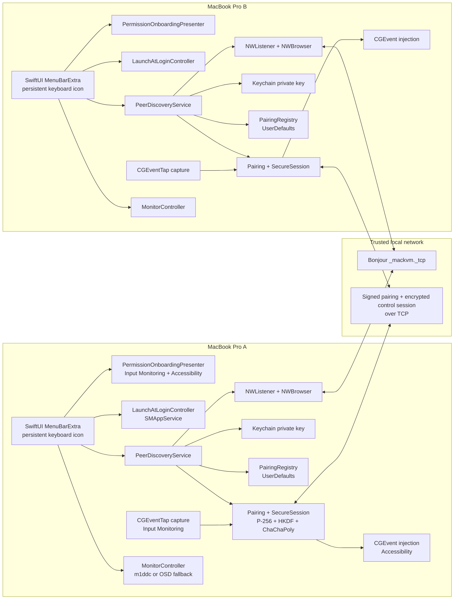
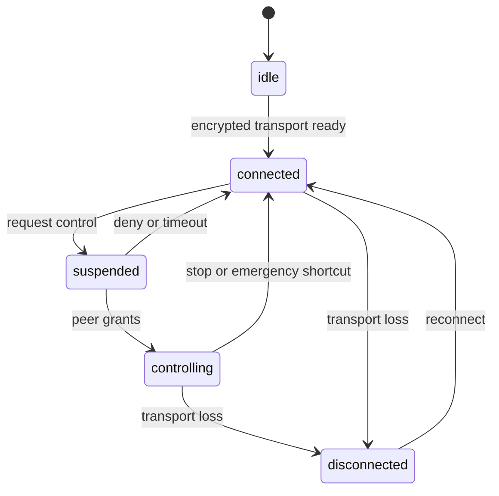
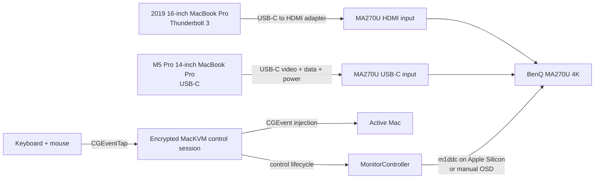

# MacKVM architecture and usage

## Current scope

The repository implements discovery, mutual pairing, a persistent encrypted
session, validated keyboard and mouse forwarding, explicit control ownership
with a safe local-return shortcut, and configurable BenQ monitor switching.



The pairing protocol currently works as follows:

1. Each Mac creates a persistent UUID and P-256 signing key. The private key
   is stored in the macOS Keychain; the public identity is advertised through
   Bonjour TXT data.
2. `NWBrowser` discovers the other Mac and reads its name, UUID, and public
   key.
3. The initiator and responder exchange signed commitments to independent
   random contributions, then reveal those contributions only after both
   commitments are fixed.
4. Both sides derive a six-digit verification code from the contributions,
   request UUID, roles, and both public keys. The user compares the code on both
   Macs.
5. Both Macs explicitly accept the matching code. The peer public key is pinned
   in `PairingRegistry` only after both signed acceptance messages, signed
   completion messages, and completion acknowledgements arrive. Each
   acknowledgement closes that Mac's sending direction; the peer's half-close
   must also arrive before trust is persisted.
6. A later control connection exchanges signed ephemeral P-256 keys, derives
   directional keys with HKDF, and requires an encrypted key-confirmation packet
   before the responder marks the session connected.
7. The controlling Mac captures selected keyboard, mouse, and scroll events
   with a suppressing `CGEventTap` only after the receiver grants control,
   validates and encrypts them, and sends them through the secure session. The
   receiver validates them again and injects them using `CGEvent`.



## Physical setup for the target KVM



Recommended wiring is USB-C for the Apple Silicon Mac and USB-C/Thunderbolt 3
to HDMI for the 2019 Intel Mac. MA270U's USB-C input carries video, data, and
up to 90 W power.

## What needs to change before this is a real KVM

### Pairing issues resolved in Step 1

- Outbound and inbound pairing both enforce the pinned public key.
- Bonjour advertising and browsing start when the app initializes.
- Only one outbound pairing request can be active, and its verification code is
  cleared on every terminal path.
- Completing or cancelling a request clears its connection timeout and receive
  buffer.

### Remaining product validation

- Verify the MA270U accepts input-source VCP commands on the actual M5 Pro
  USB-C connection. Software cannot prove this without the physical monitor.
- Complete the two-Mac checklist in [`MANUAL_TEST.md`](MANUAL_TEST.md);
  automated tests cover the signed/encrypted protocol pipeline but cannot
  grant macOS privacy permissions or generate physical keyboard input.

### Runtime responsibilities

The major runtime responsibilities are separated as follows:

```text
AppBootstrap            service wiring and launch-time startup
PermissionOnboarding    missing-permission policy, setup alert, Settings links
LaunchAtLoginController SMAppService login-item state
PeerDiscoveryService    Bonjour pairing discovery and pairing session lifecycle
SecureSessionService    authenticated encrypted message channel
InputCaptureService     CGEventTap capture and Input Monitoring state
RemoteInputSink         validated CGEvent injection and Accessibility state
MonitorController       DDC/CI input switching with manual OSD fallback
PairingRegistry         paired-peer persistence
DeviceCredentialsStore  Keychain identity persistence
```

Input capture uses the main display bounds on each Mac. Configure the MA270U as
the main display on both computers so normalized pointer positions map to the
same physical screen. Control uses a request/grant exchange; once granted,
events are suppressed locally and forwarded remotely. Press
**Control–Option–Command–Escape** at any time during control to restore local
input.

## How to use the current MVP

1. Connect both Macs to the same trusted local network.
2. Connect the 14-inch Apple Silicon Mac to MA270U by USB-C, and connect the
   2019 MacBook Pro to an MA270U HDMI input using a Thunderbolt 3/USB-C to HDMI
   adapter.
3. In **System Settings → Displays → Arrange**, make the MA270U the main
   display on both Macs.
4. On the M5 Pro, build both architecture-specific app bundles:

   ```sh
   ./scripts/build-app.sh --arch arm64
   ./scripts/build-app.sh --arch x86_64
   ```

   Copy `dist/arm64/MacKVM.app` into `/Applications` on the M5 Pro and
   `dist/x86_64/MacKVM.app` into `/Applications` on the 2019 Intel Mac. On
   each Mac, launch the installed app:

   ```sh
   open /Applications/MacKVM.app
   ```

   Do not use `swift run` for normal operation: the generated `.app` carries
   the Bonjour and Local Network privacy metadata required by macOS.
5. MacKVM appears as a keyboard icon in the menu bar. If the launch-time setup
   alert appears, select **Request Permissions**, grant the permission macOS
   requests, then quit and reopen MacKVM. It requests one missing permission
   per launch until both Input Monitoring and Accessibility are granted. If an
   earlier denial prevents a new system prompt, use the **Settings** button
   beside that permission.
6. Optionally enable **Launch MacKVM at Login** so the menu-bar icon returns
   automatically after signing in.
7. Open the MacKVM menu-bar item on either Mac to inspect nearby devices.
   Discovery already starts when the app launches.
8. Under **Nearby Macs**, select **Pair** on one Mac.
9. Compare the six-digit security code shown on both Macs. Press **Accept** on
   both Macs only when the names and codes match.
10. Install `m1ddc` on the M5 Pro Mac with `brew install m1ddc`. Select the
    **M5 / USB-C preset** there and the **Intel / HDMI preset** on the 2019 Mac.
    Test **Show this Mac** and **Show other Mac**. Leave DDC disabled and use
    the MA270U OSD if the physical test fails.
11. Select **Connect** on one Mac. When the encrypted session is connected,
    choose **Request control of other Mac** on the Mac whose keyboard and mouse
    you are using.
12. After the receiver grants control, input is sent only to the other Mac.
    Press **Control–Option–Command–Escape** to return input immediately, or use
    **Return input to this Mac** from the menu. If DDC cannot switch the monitor,
    follow the status text and select the requested input through the OSD.

Before testing, macOS may ask for local-network access. Pairing metadata and
Bonjour names are visible on the LAN, while established control-session payloads
are encrypted; see [`SECURITY.md`](SECURITY.md).

## Verification commands

Run after every code or documentation change:

```sh
./.codex/ci.sh
```

After each completed plan step, run:

```sh
./.codex/step-review.sh
```

After all steps in the complete plan are finished, run the final Claude review:

```sh
./.codex/final-review.sh
```
