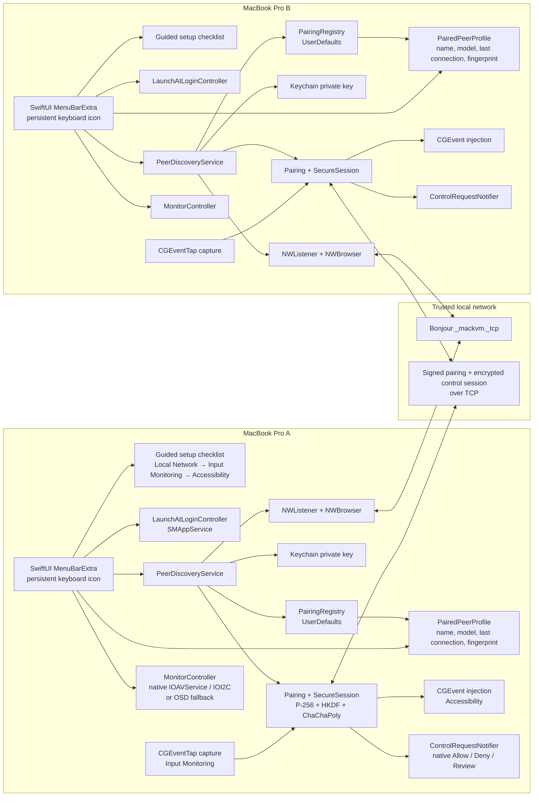
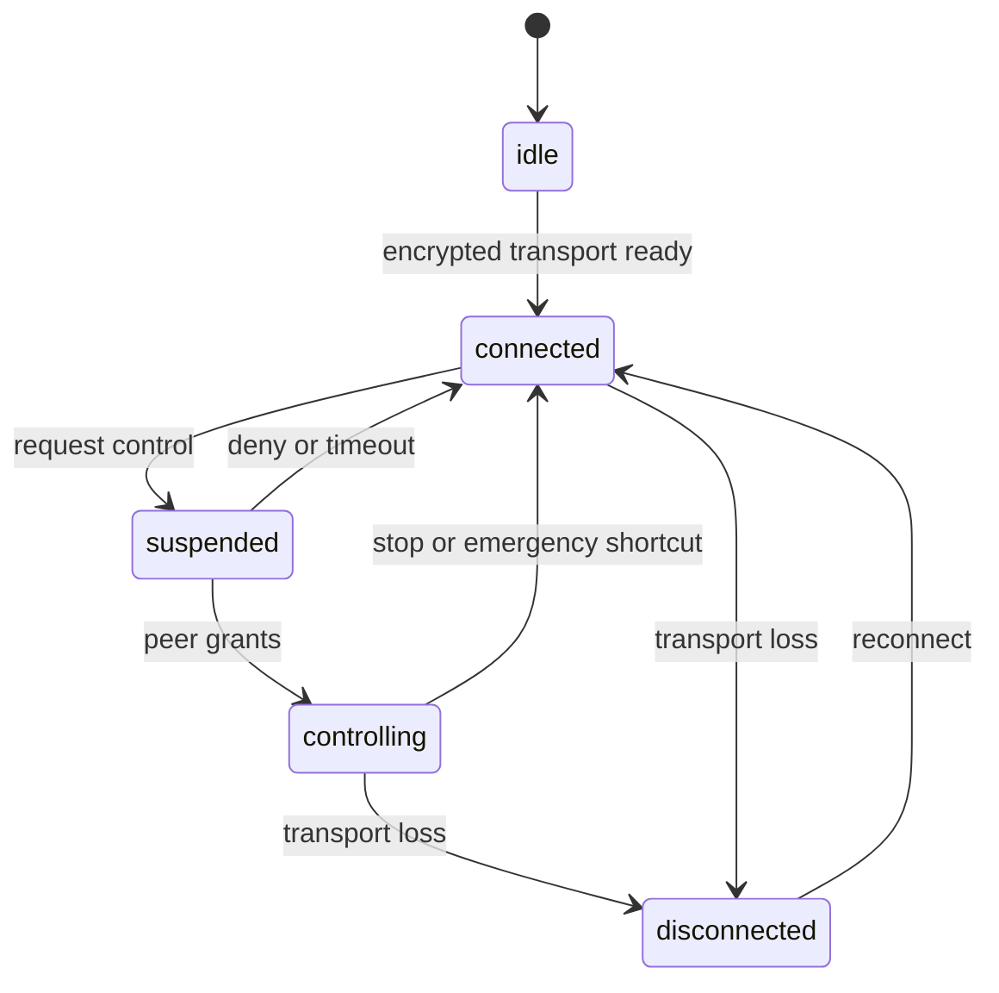
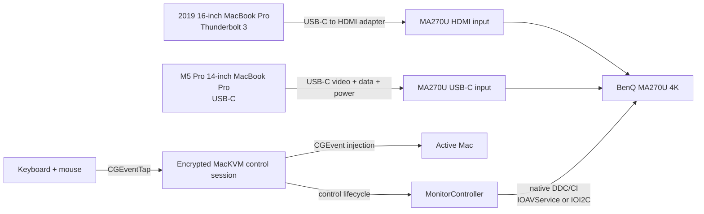
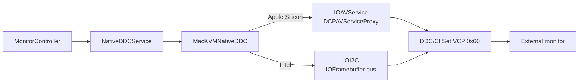
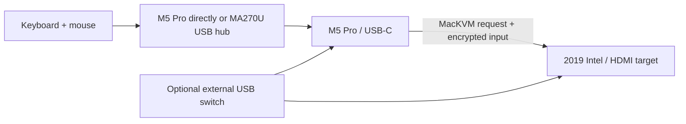

# MacKVM architecture and usage

[繁體中文](ARCHITECTURE.zh-TW.md) · [Installation guide](INSTALL.md) · [HTML manual](docs/USER_MANUAL.html)

## Current scope

The repository implements discovery, mutual pairing, a persistent encrypted
session, validated keyboard and mouse forwarding, explicit receiver consent and
safe local-return controls, a sequential macOS setup checklist, and native
DDC/CI monitor input switching.



The pairing protocol currently works as follows:

1. Each Mac creates a persistent UUID and P-256 signing key. The private key
   is stored in the macOS Keychain; the public identity is advertised through
   Bonjour TXT data.
2. `NWBrowser` discovers the other Mac and reads its name, UUID, and public
   key.
3. The initiator and responder exchange signed commitments to independent
   random contributions, then reveal those contributions only after both
   commitments are fixed.
4. Both sides derive a six-digit verification code from the contributions,
   request UUID, roles, and both public keys. The user compares the code on both
   Macs.
5. Both Macs explicitly accept the matching code. The peer public key is pinned
   in `PairingRegistry` only after both signed acceptance messages, signed
   completion messages, and completion acknowledgements arrive. Each
   acknowledgement closes that Mac's sending direction; the peer's half-close
   must also arrive before trust is persisted.
6. A later control connection exchanges signed ephemeral P-256 keys, derives
   directional keys with HKDF, and requires an encrypted key-confirmation packet
   before the responder marks the session connected.
7. The receiving Mac presents each signed/encrypted control request to its user.
   When its menu is closed, `ControlRequestNotifier` also presents a native
   Allow/Deny/Review notification. The Allow action requires macOS
   authentication at the lock screen. Its action includes the request UUID plus
   a fresh device-local notification nonce; `ControlRequestNotifier` checks the
   nonce against its one live notification, and `ControlCoordinator` separately
   checks the UUID against its one live request before taking any action.
   **Review in MacKVM** opens an explicit Allow/Deny dialog. Only after
   **Allow** is selected does
   its injection queue become ready and return a matching grant. The controlling
   Mac then captures selected
   keyboard, mouse, and scroll events with a suppressing `CGEventTap`, validates
   and encrypts them, and sends them through the secure session. The receiver
   validates them again and injects them using `CGEvent`; either side can end
   control safely.

After pairing, each Mac stores a profile beside the pinned public key. The
profile keeps the peer's validated friendly name and advertised model, records
the time of the last authenticated connection, and derives a display-only
SHA-256 fingerprint from the pinned public key. The menu lets the user edit the
friendly name and copy a support report containing these public fields plus
version, OS, and connection status. Private keys, credentials, and endpoints
are deliberately excluded from that report.



## Physical setup for the target KVM



Recommended wiring is USB-C for the Apple Silicon Mac and USB-C/Thunderbolt 3
to HDMI for the 2019 Intel Mac. MA270U's USB-C input carries video, data, and
up to 90 W power.

### Native DDC/CI transport

`MonitorController` never shells out to a helper. `NativeDDCService` calls the
small `MacKVMNativeDDC` bridge on its serial queue, and the bridge exposes only
bounded display names, selectors, and success/error results to Swift:



Discovery is limited to 32 online external displays. Each display is selected
by a `native-ddc:` identifier derived from CoreGraphics/EDID vendor, model and
serial values; numeric display indexes are never sent to IOKit. The bridge
allow-lists the five input-source values used by the app and bounds all error
text before it returns to the UI. If the display transport is unavailable or
the monitor rejects DDC/CI, switching ends with a diagnostic and the user can
choose the monitor OSD explicitly.

### Physical input topology (P0)

The monitor's HDMI input is a video path; it does not upstream the MA270U USB
hub to the Intel host. Therefore the recommended one-way topology is:



`InputTopologyController` persists an explicit mode on each Mac. **One
keyboard on M5 Pro (USB-C)** permits the Apple Silicon host to initiate input
sharing and keeps the Intel HDMI host receive-only. **External USB switch
(bidirectional)** permits either host, but the app cannot detect or validate
that physical switch; manual verification on both Macs is required. Receiving
remote control remains available in either mode.

## What needs to change before this is a real KVM

### Pairing issues resolved in Step 1

- Outbound and inbound pairing both enforce the pinned public key.
- Bonjour advertising and browsing begin only after the user handles the
  Local Network setup step, so its macOS prompt cannot race the input-permission
  prompts.
- Only one outbound pairing request can be active, and its verification code is
  cleared on every terminal path.
- Completing or cancelling a request clears its connection timeout and receive
  buffer.

### Remaining product validation

- The P2 release path now creates a fresh universal-image staging directory
  and a portable SHA-256 sidecar. Passing a Developer ID identity enables the
  hardened runtime and the release verifier checks it; Apple notarization is
  still required before distribution outside the developer's own Macs.
- Complete the real-hardware section in [`MANUAL_TEST.md`](MANUAL_TEST.md):
  verify native DDC/CI input-source VCP commands on both the M5 Pro and Intel
  connections, the OSD fallback, and the optional physical USB switch. Software
  cannot prove those behaviors without the monitor, two Macs, and macOS privacy
  prompts.

### Runtime responsibilities

The major runtime responsibilities are separated as follows:

```text
AppBootstrap            service wiring and Local Network-gated startup
PermissionOnboarding    sequential checklist, permission refresh, Settings links
LaunchAtLoginController SMAppService login-item state
PeerDiscoveryService    Bonjour pairing discovery and pairing session lifecycle
SecureSessionService    authenticated encrypted message channel
InputCaptureService     CGEventTap capture and Input Monitoring state
RemoteInputSink         validated CGEvent injection and Accessibility state
ControlRequestNotifier  native incoming-control notification and stale-action guard
MonitorController       DDC-capable display discovery, stable native selection, diagnostics, OSD fallback
PairingRegistry         paired-peer persistence
PairedPeerProfile        friendly name, model, connection time, key fingerprint
DeviceCredentialsStore  Keychain identity persistence
```

Input capture uses the main display bounds on each Mac. Configure the MA270U as
the main display on both computers so normalized pointer positions map to the
same physical screen. Control uses a request/grant exchange; the receiver must
confirm the request before events are suppressed locally and forwarded remotely.
The controller can press **Control–Option–Command–Escape**, while the receiver
can use **Stop remote control** to release injected input and return control.

`SecureSessionService` remembers only a user-selected paired peer for automatic
reconnect. `NWPathMonitor` pauses attempts while the network path is unavailable
and resumes with a bounded exponential backoff (0/1/2/4…30 seconds) after a
path or Bonjour update. A deliberate Disconnect, Forget, or app stop clears the
desired peer. Reconnection returns both Macs to a local-input state; the user
must grant control again rather than silently resuming input suppression.

Control requests carry a protocol-version range and the current macOS
physical-keyboard-layout identifier (from `TISCopyCurrentKeyboardLayoutInputSource`,
so switching an input method like Zhuyin on or off is not a layout change). A
mismatched protocol-version range is still denied before the receiver's
consent prompt; a differing keyboard layout is not, since `RemoteInputSink`
resolves it instead. Each `keyDown` for a letter, digit, or symbol key also
carries the character the sender's own layout and modifier state produced for
it. When the receiver's layout differs, it looks up which local key and
Shift/Option/Caps Lock combination produce that same character — built once
per layout change into a `KeyboardLayoutReverseMap` — and injects that key
instead of the sender's keycode, which would mean something else under a
different layout; Command and Control pass through unmodified so application
shortcuts still work. A key with no equivalent on the receiver's layout ends
remote input safely rather than injecting the wrong character. Keys outside
that letter/digit/symbol set (arrows, Return, Tab, Delete, Escape, Space,
function keys, and every modifier) occupy the same physical position on every
layout and are injected by keycode exactly as before. Missing identifiers
remain accepted for legacy peers, while new peers use the negotiation fields.

If the local identity/keychain pair becomes inconsistent, the bootstrap error
view exposes an explicit reset operation. It deletes the Keychain key and
stored identity together, clears local pairings, and requires a relaunch and
new pairing. It never rotates identity automatically.

### Runtime safety boundaries

The network and input layers use explicit bounded queues and buffers rather than
assuming a cooperative peer:

- pairing and secure-session frames are limited to 64 KiB; encrypted session
  plaintext is limited to 32 KiB;
- each pairing transport delivery processes at most 16 framed messages; a
  larger burst is rejected with a message-count error rather than decoded as
  an unbounded batch;
- secure-session decoding batches at most 16 frames at a time but may drain
  multiple batches for high-polling input; its 64 KiB buffer and packet/byte
  budgets remain the cumulative bounds;
- incomplete secure frames time out after five seconds, and secure sessions
  enforce limits on pending connections, queued payloads, packets, and bytes;
- Bonjour pairing accepts only bounded connection/message rates and rejects
  conflicting records for the same UUID;
- the coordinator and injection queue each have a 256-item admission gate. A
  full gate closes the session and releases tracked input, so key-up or
  mouse-up transitions are never silently discarded;
- `Forget` removes the pinned key before cross-service cleanup begins, then
  advances a per-peer generation so late pairing completions cannot re-add the
  trust record. Secure-session revoke also cancels all anonymous handshakes,
  because an unauthenticated context cannot yet be attributed to a different
  peer; an unrelated handshake may therefore need to retry after Forget.

These limits are enforced before JSON decoding or event injection where
possible. They are defensive availability controls; the encrypted channel and
signed identity checks remain the authorization boundary.

The CGEvent teardown path is OS-dependent; manual QA should verify that ending
remote control releases held regular keys, modifiers, and mouse buttons while
preserving locally held modifiers. Pure modifier projection and admission
behavior are covered by the automated test suite.

## How to use the current MVP

1. Connect both Macs to the same trusted local network.
2. Connect the 14-inch Apple Silicon Mac to MA270U by USB-C, and connect the
   2019 MacBook Pro to an MA270U HDMI input using a Thunderbolt 3/USB-C to HDMI
   adapter.
3. In **System Settings → Displays → Arrange**, make the MA270U the main
   display on both Macs.
4. In the MacKVM menu, keep **One keyboard on M5 Pro (USB-C)** for the
   current wiring and connect the keyboard/mouse to the M5 Pro or its MA270U
   USB hub. HDMI cannot carry the monitor hub upstream to the Intel Mac. Only
   select **External USB switch (bidirectional)** after both Macs visibly see
   the devices through a physical switch.
5. On the M5 Pro, build both architecture-specific app bundles:

   ```sh
   ./scripts/build-app.sh --arch arm64
   ./scripts/build-app.sh --arch x86_64
   ```

   Copy `dist/arm64/MacKVM.app` into `/Applications` on the M5 Pro and
   `dist/x86_64/MacKVM.app` into `/Applications` on the 2019 Intel Mac. On
   each Mac, launch the installed app:

   ```sh
   open /Applications/MacKVM.app
   ```

   Do not use `swift run` for normal operation: the generated `.app` carries
   the Bonjour and Local Network privacy metadata required by macOS.
6. MacKVM appears as a keyboard icon in the menu bar. Open it and complete
   **Set up this Mac** in order: select **Enable Local Network**, answer the
   macOS prompt and select **I handled the macOS prompt**, then request Input
   Monitoring and Accessibility one at a time. Returning from System Settings
   refreshes the checklist; **Review Local Network Settings** remains available
   for a prior Local Network denial because macOS does not expose its result to
   MacKVM.
7. After that checklist finishes, select **Enable** next to **Control request
   notifications**. This optional macOS alert permission should be handled
   before the first request, outside its short consent window. A control
   request never triggers this authorization sheet by itself; without alerts,
   MacKVM adds a warning symbol beside its keyboard menu-bar icon and retains
   the menu controls.
8. Optionally enable **Launch MacKVM at Login** so the menu-bar icon returns
   automatically after signing in.
9. After the Local Network step is complete, open the MacKVM menu-bar item on
   either Mac to inspect nearby devices.
10. Under **Nearby Macs**, select **Pair** on one Mac.
11. Compare the six-digit security code shown on both Macs. Verify the peer name
   on each Mac, then press **Accept** on both Macs only when the codes match.
12. On either Mac, select **Detect DDC-capable displays** and choose the
    intended display explicitly before selecting the matching preset. Native
    DDC/CI uses `IOAVService` on Apple Silicon and `IOI2C` on Intel. Test
    **Show this Mac** and **Show other Mac**. If the display does not expose
    DDC/CI, follow the diagnostic and use the monitor OSD.
13. Select **Connect** on one Mac. When the encrypted session is connected,
    choose **Request control of other Mac** on the Mac whose keyboard and mouse
    you are using.
14. The receiving Mac must select **Allow** before input is sent only to the
    other Mac. With the menu closed, it can use the native notification's
    **Allow**, **Deny**, or **Review in MacKVM** action; Review opens an
    explicit approval dialog, Allow requires macOS authentication if the
    receiver is locked, and old/expired actions are ignored. Press
    **Control–Option–Command–Escape** or use **Return input to
    this Mac** on the controller; the receiver can also select **Stop remote
    control**. If DDC cannot switch the monitor, follow the diagnostic and
    select the requested input through the OSD.

After an authenticated transport loss, the selected peer is retried with
bounded backoff and no new pairing. The next control request still requires a
fresh Allow action. Use **Disconnect** or **Forget** to clear the reconnect
intent. If the bootstrap screen reports an identity/keychain mismatch, use its
explicit reset action, relaunch, and pair both Macs again.

Before testing, macOS may ask for local-network access. Pairing metadata and
Bonjour names are visible on the LAN, while established control-session payloads
are encrypted; see [`SECURITY.md`](SECURITY.md).
