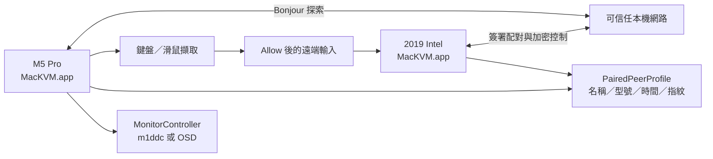
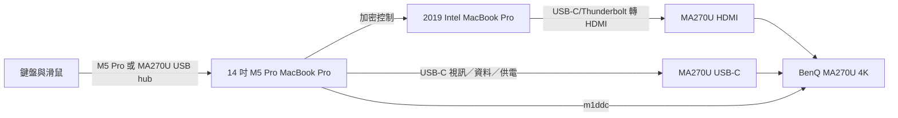
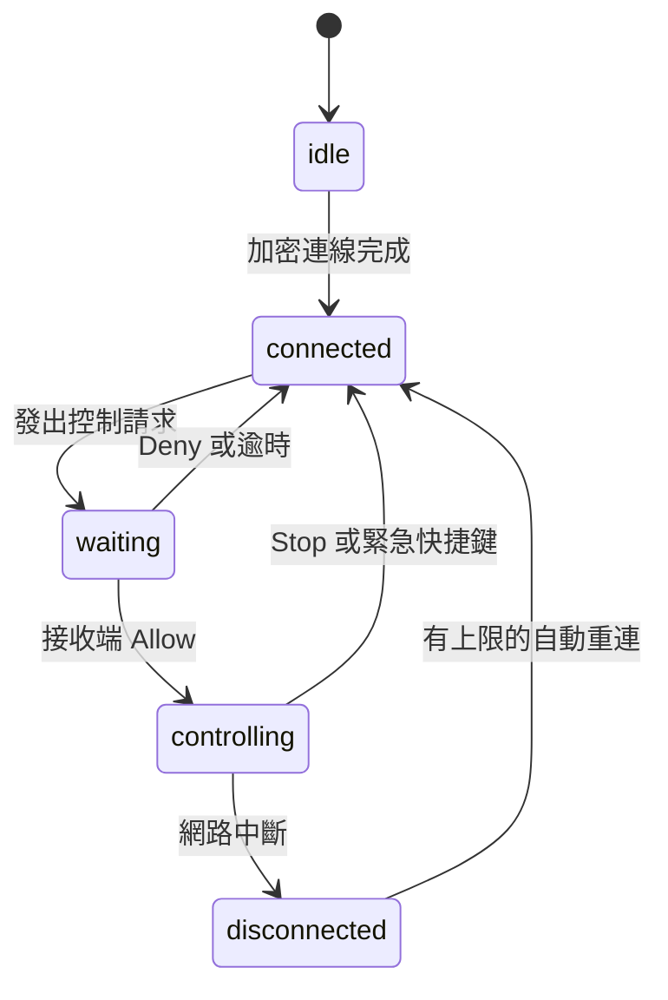

[English](ARCHITECTURE.md) · [安裝指南](INSTALL.zh-TW.md)

# MacKVM 架構與使用說明

## 系統範圍

MacKVM 是 macOS 選單列工具，實作附近裝置探索、雙方配對、持久化加密連線、
鍵盤與滑鼠轉送、接收端明確同意、安全返回、權限設定檢查與 BenQ MA270U 輸入切換。

## 主要元件

- `AppBootstrap`：建立服務、處理本機網路導向啟動與身份復原。
- `PermissionOnboarding`：依序要求 Local Network、Input Monitoring、Accessibility，
  並提供系統設定連結。
- `PeerDiscoveryService`：Bonjour 探索、配對請求、驗證碼與配對生命週期。
- `PairingRegistry`：保存已配對 peer 的公開金鑰與 generation；不保存私密金鑰。
- `PairedPeerProfile`：保存友善名稱、型號、最後成功連線時間與公開金鑰指紋。
- `SecureSessionService`：簽署短期 P-256 握手、HKDF、ChaChaPoly 與序號防重放。
- `ControlCoordinator`：控制請求、Allow／Deny／Stop、session generation 與輸入狀態。
- `InputCaptureService`／`RemoteInputSink`：擷取與驗證鍵盤、滑鼠、滾輪事件。
- `ControlRequestNotifier`：選單關閉時顯示帶有 request ID 與 nonce 的原生通知。
- `MonitorController`：在 Apple Silicon 執行 m1ddc，並提供 MA270U OSD 手動備援。

## 配對與安全連線流程

1. 每台 Mac 產生持久化 UUID 與 P-256 簽署金鑰；私密金鑰存於 Keychain，公開身份
   透過 Bonjour TXT 廣播。
2. `NWBrowser` 讀取對方的名稱、UUID、型號與公開金鑰。這些資料可在本機網路被看見，
   但不代表已建立信任。
3. 發起端與回應端交換簽署的 commitment，再揭露獨立的隨機貢獻。
4. 雙方用貢獻、request UUID、角色與公開金鑰計算六位數驗證碼，使用者在兩台 Mac
   比對後明確按 **Accept**。
5. 完成訊息與 acknowledgement 都成功、TCP half-close 確認後，才將公開金鑰釘選到
   peer UUID。取消或 Forget 會清除延遲完成，避免舊配對恢復信任。
6. 控制連線交換簽署的短期 P-256 金鑰，使用方向分離的 HKDF 金鑰與 ChaChaPoly；
   接收端解開新鮮的 key-confirmation 後才發布 connected。
7. 只有接收端按 **Allow** 後，控制端才會抑制本機輸入並送出事件。重連後仍需重新
   同意，不會靜默恢復控制。

## 配對裝置資料

`PairingRegistry` 的公開金鑰仍是認證信任根；`PairedPeerProfile` 是另外的本機
UserDefaults JSON 資料。配對時保存簽署身份的友善名稱與 Bonjour 型號，安全連線在
完成 key confirmation 後更新最後連線時間。使用者可在選單的
**Paired device information** 修改友善名稱。

金鑰指紋是公開金鑰 bytes 的 SHA-256，以冒號分隔的 32 組大寫十六進位顯示。支援
資訊只包含這類公開診斷資料、版本、作業系統與連線狀態，不包含私密金鑰、憑證、密碼
或網路 endpoint。

## 目標硬體資料流

HDMI 只傳送影像，不會把 MA270U USB hub 上游給 Intel host。因此目前建議選
**One keyboard on M5 Pro (USB-C)**，讓 M5 Pro 發起控制、Intel Mac 接收控制。
只有在實體 USB switch 讓兩台 Mac 都看到裝置時，才選
**External USB switch (bidirectional)**；app 無法從軟體驗證 switch 是否存在。

## 連線與輸入狀態

`NWPathMonitor` 在網路不可用時暫停重連，恢復後使用 0／1／2／4…30 秒退避。手動
**Disconnect**、**Forget** 或退出 app 會清除重連目標。控制請求與鍵盤輸入會檢查
協定版本和 keyboard layout；不相容時在同意前拒絕，控制中途變更 layout 則安全停止。

## 防護邊界

- 配對與 secure-session frame 上限為 64 KiB，加密 plaintext 上限為 32 KiB。
- 不完整 frame 五秒後逾時；連線數、訊息數、payload queue、封包與 bytes 都有上限。
- Bonjour 候選裝置、同一 UUID 的 endpoint 與 pairing request 都採 bounded admission。
- 控制或注入 queue 無法跟上時會結束 session 並釋放按鍵／滑鼠按鈕，不靜默丟失狀態。
- Forget 先移除釘選公開金鑰，再取消匿名 handshake 與遲到的配對完成。

這些是本機網路上的可用性防護；真正的授權邊界仍是已釘選公開金鑰、簽署握手、加密
通道與接收端的明確控制同意。

## 使用步驟

請先依照[繁體中文安裝指南](INSTALL.zh-TW.md)完成架構對應的 app、權限、MA270U
輸入來源與配對。日常操作時，在 **Paired device information** 查看或修改名稱，
需要回報問題按 **Copy support information**；要停止控制則使用
**Return input to this Mac**、**Stop remote control** 或
`Control-Option-Command-Escape`。
