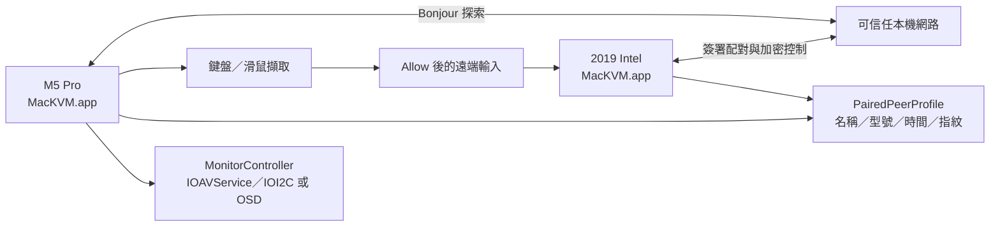
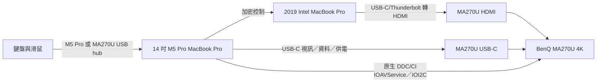
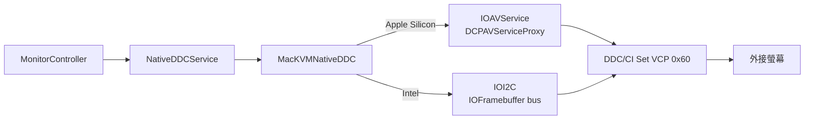
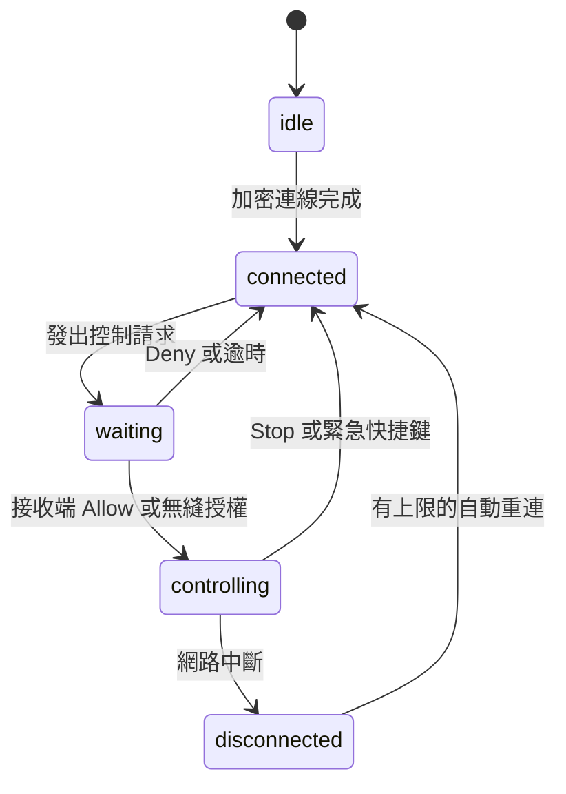

[English](ARCHITECTURE.md) · [安裝指南](INSTALL.zh-TW.md) · [HTML 手冊](docs/USER_MANUAL.zh-TW.html)

# MacKVM 架構與使用說明

## 系統範圍

MacKVM 是 macOS 選單列與一般視窗工具，實作附近裝置探索、雙方配對、持久化加密連線、
鍵盤與滑鼠轉送、接收端明確同意、安全返回、權限設定檢查與原生 DDC/CI 螢幕輸入切換。

## 主要元件

- `AppBootstrap`：建立服務、處理本機網路導向啟動與身份復原。
- `PermissionOnboarding`：依序要求 Local Network、Input Monitoring、Accessibility，
  並提供系統設定連結。
- `PeerDiscoveryService`：Bonjour 探索、配對請求、驗證碼與配對生命週期。
- `PairingRegistry`：保存已配對 peer 的公開金鑰與 generation；不保存私密金鑰。
- `PairedPeerProfile`：保存友善名稱、型號、最後成功連線時間、公開金鑰指紋與每台
  配對 Mac 的無縫控制授權。
- `SecureSessionService`：簽署短期 P-256 握手、HKDF、ChaChaPoly 與序號防重放。
- `ControlCoordinator`：控制請求、Allow／Deny／Stop、session generation 與輸入狀態。
- `InputCaptureService`／`RemoteInputSink`：擷取與驗證鍵盤、滑鼠、滾輪事件。
- `ControlRequestNotifier`：選單關閉時顯示帶有 request ID 與 nonce 的原生通知。
- `MonitorController`：探索支援 DDC/CI 的顯示器；Apple Silicon 使用 `IOAVService`、
  Intel 使用 `IOI2C`，並提供螢幕 OSD 手動備援。

外接螢幕不是配對或遠端控制的必要條件；它只用於 DDC 輸入切換與跨螢幕指標定位。

## 配對與安全連線流程

1. 每台 Mac 產生持久化 UUID 與 P-256 簽署金鑰；私密金鑰存於 Keychain，公開身份
   透過 Bonjour TXT 廣播。
2. `NWBrowser` 讀取對方的名稱、UUID、型號與公開金鑰。這些資料可在本機網路被看見，
   但不代表已建立信任。
3. 發起端與回應端交換簽署的 commitment，再揭露獨立的隨機貢獻。
4. 雙方用貢獻、request UUID、角色與公開金鑰計算六位數驗證碼，使用者在兩台 Mac
   比對後，接收端按 **Accept**、發起端按 **Confirm code**。
   任一台 Mac 都可以擔任發起端；若接收端的 listener 因 macOS Firewall 等待，選單可按
   **Cancel pairing** 或 **Retry pairing**。這是傳輸／防火牆狀態，不是 Apple Silicon 與
   Intel 的密碼角色差異。
5. 完成訊息與 acknowledgement 都成功、TCP half-close 確認後，才將公開金鑰釘選到
   peer UUID。取消或 Forget 會清除延遲完成，避免舊配對恢復信任。
6. 控制連線交換簽署的短期 P-256 金鑰，使用方向分離的 HKDF 金鑰與 ChaChaPoly；
   接收端解開新鮮的 key-confirmation 後才發布 connected。
7. 控制端需要 Input Monitoring 與 Accessibility，才能用 active event tap 抑制本機輸入並
   送出事件；接收端也需要 Accessibility 來注入事件。新配對的接收端會使用本機的無縫
   控制授權自動核准；若使用者關閉該授權，才需要按 **Allow**。重連後同樣依此設定處理。

## 配對裝置資料

`PairingRegistry` 的公開金鑰仍是認證信任根；`PairedPeerProfile` 是另外的本機
UserDefaults JSON 資料。配對時保存簽署身份的友善名稱與 Bonjour 型號，安全連線在
完成 key confirmation 後更新最後連線時間。新配對會啟用無縫控制授權，使用者可在選單的
**Paired device information** 修改友善名稱或關閉每台裝置的授權。

金鑰指紋是公開金鑰 bytes 的 SHA-256，以冒號分隔的 32 組大寫十六進位顯示。支援
資訊只包含這類公開診斷資料、版本、作業系統與連線狀態，不包含私密金鑰、憑證、密碼
或網路 endpoint。

## 目標硬體資料流

HDMI 只傳送影像，不會把 MA270U USB hub 上游給 Intel host。因此目前建議選
**One keyboard on M5 Pro (USB-C)**，讓 M5 Pro 發起控制、Intel Mac 接收控制。
只有在實體 USB switch 讓兩台 Mac 都看到裝置時，才選
**External USB switch (bidirectional)**；app 無法從軟體驗證 switch 是否存在。

### 原生 DDC/CI 傳輸

`MonitorController` 不會啟動外部工具。`NativeDDCService` 在序列佇列呼叫
`MacKVMNativeDDC` 原生 bridge，只把有界的顯示器名稱、識別碼與成功／錯誤結果交給
Swift：

探索最多處理 32 台線上外接螢幕。每台螢幕使用從 CoreGraphics／EDID 廠商、型號與序號
建立的 `native-ddc:` 識別碼；不會把可能變動的數字索引送進 IOKit。bridge 只允許 app
使用的五個輸入來源值，錯誤文字也會限制長度。若線材或螢幕沒有 DDC/CI，介面顯示
診斷，使用者可明確改用 OSD。

### 跨架構 DDC 診斷工具

`Tools/DDCDiagnostic/ddc-diagnostic.m` 是和 app 共用原生 bridge 的獨立診斷程式，
`scripts/build-ddc-diagnostic.sh` 可建置 `arm64`、`x86_64` 與 universal 版本。因此
可以在 M5 Pro 與 2019 Intel Mac 各自取得報告，不需要 Homebrew 或外部 helper。報告會
合併系統架構／型號、原生 selector、EDID 身份與 checksum、原生 transport（Apple
Silicon 的 `IOAVService` 或 Intel 的 `IOFramebuffer`／`IOI2C`），以及 VCP `0x60`
讀值。

可選的 `--scan-inputs` 與 app 的一般操作分開。它只會把使用者提供的候選值寫入 VCP
`0x60`，逐一讀回，只有讀回相同才標記 `accepted=yes`，最後還原掃描前的輸入。這能
區分「I2C 傳輸成功」與「螢幕韌體真的接受該 mapping」。工具不會自動修改 app mapping，
也不會讀取身份、私密金鑰、憑證或網路端點。本專案實測 MA270U 的 USB-C 是 `19`
（`0x13`），HDMI 1 是 `17`（`0x11`）；其他型號必須以自己的報告與掃描確認。請參閱
[診斷工具說明](Tools/DDCDiagnostic/README.zh-TW.md) 與[原始碼](Tools/DDCDiagnostic/ddc-diagnostic.m)。
按下 Ctrl-C 或收到 SIGTERM 時會停止候選值迴圈，仍嘗試還原開始前的輸入。

## 連線與輸入狀態

`NSWorkspace` 的睡眠／喚醒通知會在網路暫停前關閉 active transport，保留重連目標，並在
喚醒後重新啟動安全探索。`NWPathMonitor` 在網路不可用時暫停重連，恢復後使用
0／1／2／4…30 秒退避。手動 **Disconnect**、**Forget** 或退出 app 會清除重連目標。
控制請求與鍵盤輸入會檢查協定版本和 keyboard layout；不相容時在同意前拒絕，控制中途
變更 layout 則安全停止。

## 防護邊界

- 配對與 secure-session frame 上限為 64 KiB，加密 plaintext 上限為 32 KiB。
- 不完整 frame 五秒後逾時；連線數、訊息數、payload queue、封包與 bytes 都有上限。
- Bonjour 候選裝置、同一 UUID 的 endpoint 與 pairing request 都採 bounded admission。
- 控制或注入 queue 無法跟上時會結束 session 並釋放按鍵／滑鼠按鈕，不靜默丟失狀態。
- Forget 先移除釘選公開金鑰，再取消匿名 handshake 與遲到的配對完成。

這些是本機網路上的可用性防護；真正的授權邊界仍是已釘選公開金鑰、簽署握手、加密
通道與接收端的控制同意。無縫授權是配對後保存在接收端的本機一次性同意。

## 使用步驟

請先依照[繁體中文安裝指南](INSTALL.zh-TW.md)完成架構對應的 app、權限、DDC/CI
輸入來源與配對。配對完成後 MacKVM 會自動嘗試建立安全連線；若仍顯示 idle，可在已配對
裝置列按 **Connect**。日常操作時，在 **Paired device information** 查看或修改名稱、
關閉無縫控制授權，
需要回報問題按 **Copy support information**。實體鍵盤與滑鼠接在 M5 Pro 時，按
**Show other Mac** 會沿用受保護的先切畫面流程，並在控制前置條件完成時開始分享；
**Share keyboard and mouse with [Intel Mac]** 是明確的等效操作。要從 Intel Mac 返回 M5 Pro，接收端按
**Return keyboard and mouse to [M5 Mac]**，控制端也可按
**Return keyboard and mouse to this Mac** 可交還控制權；在手動選好螢幕輸入後，使用
`Control-Option-Command-K` 可在閒置／控制中切換鍵盤／滑鼠控制，或用
`Control-Option-Command-Escape` 緊急中斷。獨立的
`Control-Option-Command-O` 沿用 **Show other Mac** 的受保護流程，先切換螢幕再請求
鍵盤／滑鼠控制；如果本機正在接收控制，則結束接收並把螢幕與輸入還給控制端。
